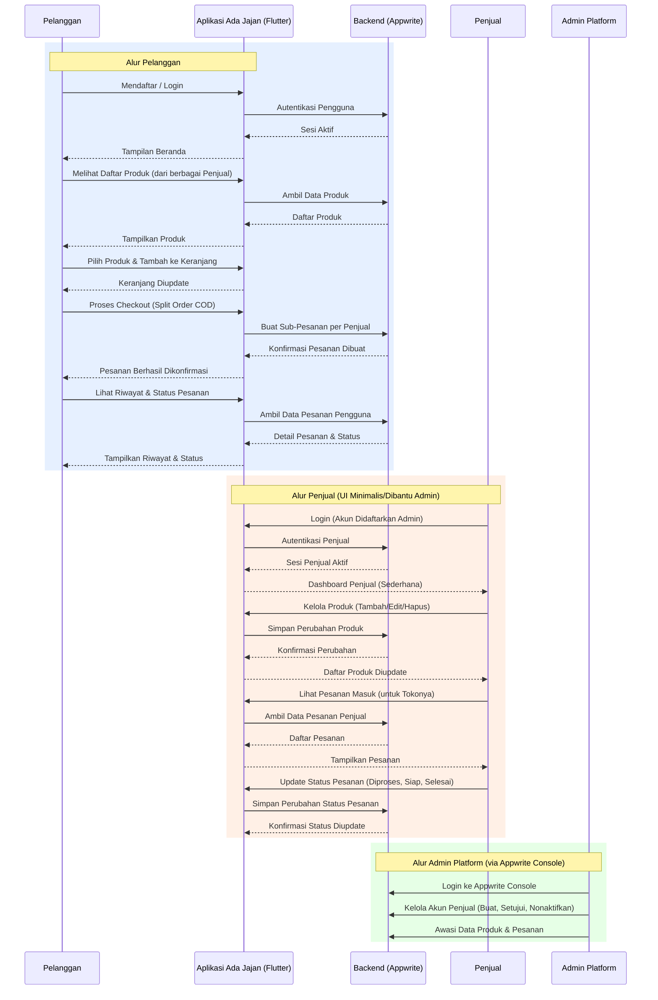

# Software Requirements Specification (SRS)
## Aplikasi "Ada Jajan" (MVP Multi-Vendor COD - Rinci)

**Versi:** 1.0 (MVP)  
**Tanggal:** 27 Oktober 2023  
**Platform:** Flutter (Aplikasi Mobile), Appwrite (Sistem Backend)

---

## 1. Pendahuluan

### 1.1 Tujuan Dokumen
Dokumen ini adalah panduan terperinci untuk membuat versi awal (Minimum Viable Product/MVP) dari aplikasi "Ada Jajan". Tujuan utama aplikasi ini adalah memungkinkan pelanggan untuk memesan jajanan pasar secara pre-order dari berbagai penjual yang terdaftar, dengan sistem pembayaran tunai saat barang diterima (Cash On Delivery/COD).

### 1.2 Lingkup MVP
Versi awal ini akan mencakup fungsi-fungsi inti berikut:

- **Untuk Pelanggan:**  
  Pendaftaran akun, login, pencarian dan penjelajahan produk dari berbagai penjual, penambahan produk ke keranjang belanja, proses checkout dengan pemecahan pesanan per penjual (split order), dan pelacakan status pesanan sederhana.

- **Untuk Penjual:**  
  Proses pendaftaran yang dibantu oleh Admin Platform, kemampuan untuk mengelola (tambah, edit, hapus, aktifkan/nonaktifkan) produk jualannya, melihat pesanan yang masuk ke tokonya, dan mengupdate status pesanan tersebut. Pengelolaan ini dilakukan melalui antarmuka (UI) yang sangat minimalis di aplikasi Flutter atau dengan bantuan Admin Platform via Appwrite Console.

- **Untuk Admin Platform:**  
  Mengelola pendaftaran dan akun penjual, memoderasi konten jika diperlukan, dan memiliki akses ke seluruh data untuk pengawasan melalui Appwrite Console.

- **Sistem Pembayaran:**  
  Hanya mendukung metode Cash On Delivery (COD).

---

## 2. Gambaran Umum Aplikasi

### 2.1 Konsep Aplikasi
"Ada Jajan" berfungsi sebagai sebuah marketplace mobile yang menghubungkan pembeli jajanan pasar dengan para penjual lokal. Aplikasi ini memfasilitasi transaksi pre-order, di mana pelanggan memesan terlebih dahulu dan membayar saat produk diterima.

### 2.2 Pengguna Utama dan Alur Interaksi Kunci

Aplikasi ini memiliki tiga jenis pengguna utama dengan alur interaksi spesifik mereka:

- **Pelanggan (Customer):** Fokus pada penemuan produk dan proses pemesanan.
- **Penjual (Vendor/Seller):** Fokus pada manajemen produk dan pemenuhan pesanan.
- **Admin Platform (Admin):** Fokus pada pengelolaan sistem dan pengguna.

### 2.3 Batasan dan Fitur yang Ditunda (Untuk MVP)

Fitur-fitur berikut **tidak akan diimplementasikan** pada tahap MVP pertama, dan akan dipertimbangkan di versi selanjutnya:

- ❌ **Metode Pembayaran Non-COD**: seperti transfer bank, e-wallet, atau payment gateway.
- ❌ **Pembatalan Otomatis Pesanan**: pelanggan tidak dapat membatalkan secara mandiri.
- ❌ **Notifikasi Push Otomatis**: tidak ada pemberitahuan real-time.
- ❌ **Fitur Sosial & Pemasaran**: seperti rating produk, ulasan, kupon, diskon, dan sistem poin loyalitas.
- ❌ **Pencarian & Filter Lanjutan**: filter berdasarkan lokasi, harga, ketersediaan ditunda.
- ❌ **Manajemen Inventaris Otomatis**: tidak ada pelacakan stok otomatis.

---

## 3. Kebutuhan Spesifik Aplikasi

### 3.1 Kebutuhan Fungsional (RF)

#### RF untuk Pelanggan
- **RF-P01**: Pelanggan dapat mendaftar dan membuat akun.
- **RF-P02**: Pelanggan dapat login ke aplikasi.
- **RF-P03**: Pelanggan dapat logout dari sesi aplikasi.
- **RF-P04**: Pelanggan dapat melihat daftar produk dari semua penjual.
- **RF-P05**: Pelanggan dapat melihat detail produk.
- **RF-P06**: Pelanggan dapat melihat profil penjual dari halaman produk.
- **RF-P07**: Pelanggan dapat menambahkan produk ke keranjang.
- **RF-P08**: Pelanggan dapat mengelola isi keranjang.
- **RF-P09**: Pelanggan dapat melakukan checkout yang menghasilkan sub-pesanan berdasarkan penjual.
- **RF-P10**: Pelanggan dapat melihat konfirmasi pesanan yang telah dibuat.
- **RF-P11**: Pelanggan dapat melihat riwayat dan status pesanan mereka.

#### RF untuk Penjual
- **RF-S01**: Penjual dapat login dengan akun yang dibuat oleh admin.
- **RF-S02**: Penjual dapat melihat dan mengedit profil toko (jika tersedia).
- **RF-S03**: Penjual dapat menambahkan produk baru.
- **RF-S04**: Penjual dapat mengedit produk.
- **RF-S05**: Penjual dapat menghapus produk.
- **RF-S06**: Penjual dapat mengaktifkan atau menonaktifkan produk.
- **RF-S07**: Penjual dapat melihat pesanan yang masuk ke tokonya.
- **RF-S08**: Penjual dapat memperbarui status pesanan (Diproses, Siap Diambil, Selesai).
- **RF-S09**: Penjual dapat menyelesaikan pesanan secara manual setelah proses COD.

#### RF untuk Admin Platform
- **RF-A01**: Admin dapat melihat daftar calon penjual dan mengelola status mereka.
- **RF-A02**: Admin dapat menyetujui dan mengaktifkan akun penjual.
- **RF-A03**: Admin dapat menonaktifkan akun penjual.
- **RF-A04**: Admin dapat mengelola semua akun pengguna.
- **RF-A05**: Admin dapat melihat semua data produk dan pesanan.
- **RF-A06**: Admin dapat membantu teknis login/akun melalui Appwrite Console.

---

### 3.2 Kebutuhan Non-Fungsional (KNF)

| Kode | Kebutuhan Non-Fungsional                          |
|------|---------------------------------------------------|
| KNF01 | Aplikasi harus memiliki performa cepat dan ringan. |
| KNF02 | Data pengguna dan transaksi harus aman (hashed, role-based access). |
| KNF03 | UI harus intuitif dan mudah digunakan oleh semua kalangan. |
| KNF04 | Data pesanan dan produk harus konsisten dan tidak boleh hilang. |
| KNF05 | Kode Flutter harus modular, terstruktur, dan dapat diperluas. |
| KNF06 | Appwrite harus dikonfigurasi untuk multi-tenant dan skalabilitas. |

---

## 4. Model Data (Skema Database Appwrite - Ringkasan)

> Catatan: Setiap tenant/organisasi akan memiliki set database sendiri sesuai skema multi-tenant (isolated databases per seller group).

### Koleksi `users`
- `userId`: ID unik pengguna
- `name`: Nama lengkap
- `email`: Email unik
- `password`: Password (terenkripsi)
- `role`: Peran (pelanggan / penjual / admin)
- `sellerProfileId`: (opsional, relasi ke `sellers`)

### Koleksi `sellers`
- `sellerId`: ID unik penjual
- `userId`: relasi ke `users`
- `storeName`: Nama toko
- `storeLocationText`: Lokasi (bisa berupa string)
- `contactPhone`: Nomor HP
- `isApproved`: status disetujui admin
- `isActive`: status aktif/tidak aktif

### Koleksi `products`
- `productId`: ID produk
- `sellerId`: relasi ke penjual
- `name`: nama produk
- `description`: deskripsi
- `price`: harga
- `imageUrl`: URL gambar
- `estimatedPreparationTime`: waktu estimasi
- `isActive`: status aktif produk

### Koleksi `orders`
- `orderId`: ID unik
- `userId`: pemesan
- `sellerId`: penjual
- `items`: array berisi `productId`, `productName`, `priceAtOrder`, `quantity`, `itemSubtotal`
- `totalAmount`: total harga semua item
- `paymentMethod`: hanya COD (untuk MVP)
- `status`: [Pending, Diproses, Siap Diambil, Selesai]
- `createdAt`: tanggal dibuat

---

### 5. Prioritas Implementasi MVP

1. ✅ **Alur Pelanggan**  
   Registrasi/Login, lihat produk multi-vendor, tambah keranjang, checkout split-order COD, lihat status pesanan.

2. ✅ **Alur Admin Platform**  
   Pendaftaran & aktivasi penjual, manajemen pengguna melalui Appwrite Console.

3. ✅ **Alur Penjual**  
   Lihat pesanan masuk, ubah status pesanan, kelola produk dasar (jika diperlukan via Appwrite Console atau Flutter UI minimal).

---

> **Dokumen ini bersifat hidup** dan akan diperbarui seiring dengan perubahan kebutuhan dan masukan dari pengujian awal MVP.

