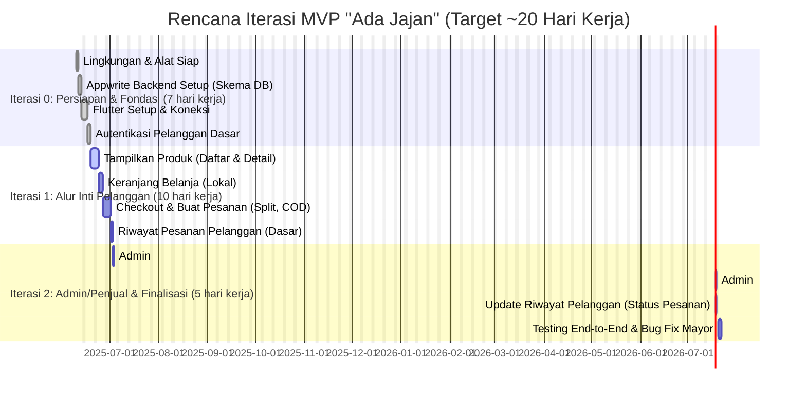

# Rencana Iterasi Pengembangan MVP "Ada Jajan" (Target 1 Bulan)

**Penting:** Target sebulan ini sangat ambisius untuk pemula. Rencana ini dirancang untuk memaksimalkan progres dengan fokus tinggi dan penyederhanaan. Fleksibilitas dan penyesuaian akan dibutuhkan.

---

## Iterasi 0: Persiapan & Fondasi (Target: ~5–7 Hari Kerja)

**Tujuan:** Menyiapkan lingkungan, memahami alat, membangun dasar backend dan koneksi frontend, serta autentikasi pelanggan.

**Checklist Progres Iterasi 0:**

- [V] **Lingkungan & Alat:**
  - [V] Akun Appwrite (Cloud atau Self-hosted) siap digunakan.
  - [V] Flutter SDK terinstal dan berfungsi.
  - [V] Editor Kode (VS Code/Android Studio) dengan plugin Flutter & Dart terkonfigurasi.
- [V] **Appwrite Backend Setup:**
  - [V] Buat Project baru di Appwrite Console.
  - [V] Buat Collection `users` (tambahkan `role`, `sellerProfileId`).
  - [V] Buat Collection `sellers` (`userId`, `storeName`, `storeLocationText`, `contactPhone`, `isApproved`, `isActive`).
  - [V] Buat Collection `products` (`sellerId`, `name`, `price`, `imageUrl`, `estimatedPreparationTime`, `isActive`).
  - [V] Buat Collection `orders` (`userId`, `sellerId`, `items`, `totalAmount`, `paymentMethod`, `status`, `createdAt`).
  - [V] Atur Permissions dasar untuk setiap collection.
  - [V] (Opsional) Masukkan 1–2 data dummy manual untuk `sellers` dan `products`.
- [V] **Flutter Frontend Setup & Koneksi:**
  - [V] Buat Project Flutter baru.
  - [V] Tambahkan dependency `appwrite`.
  - [V] Inisialisasi Appwrite Client di Flutter.
  - [V] Buat service dasar untuk interaksi dengan Appwrite.
  - [V] Tes koneksi: fetch data dummy `products` dan tampilkan di console.
- [V] **Autentikasi Pelanggan:**
  - [V] Buat UI layar Registrasi (form & tombol).
  - [V] Implementasi fungsi registrasi dengan `account.create()`.
  - [V] Buat UI layar Login.
  - [V] Implementasi login dengan `account.createEmailSession()`.
  - [V] Implementasi fungsi logout.
  - [V] Setup navigasi dasar (Splash, Auth, Home).
  - [V] State management sederhana untuk status login.

---

## Iterasi 1: Alur Inti Pelanggan (Target: ~10–12 Hari Kerja)

**Tujuan:** Pelanggan dapat melihat produk dari berbagai penjual, menambahkannya ke keranjang, dan melakukan checkout dengan sistem split order COD. Pesanan tersimpan di backend.

**Checklist Progres Iterasi 1:**

- [ ] **Tampilan Produk:**
  - [ ] UI Halaman Home/Daftar Produk
    - [ ] Fetch dan tampilkan `products` aktif dari Appwrite.
    - [ ] Tampilkan nama toko dari `sellers`.
    - [ ] List/Grid: foto, nama produk, harga, nama toko.
  - [ ] UI Halaman Detail Produk:
    - [ ] Navigasi dengan ID produk.
    - [ ] Tampilkan detail produk dari Appwrite.
  - [ ] (Opsional) UI Halaman Profil Penjual Sederhana.
- [ ] **Keranjang Belanja:**
  - [ ] State Management untuk keranjang (`Provider`).
  - [ ] Model `CartItem` (produk, quantity, sellerId).
  - [ ] Fungsi "Tambah ke Keranjang".
  - [ ] UI Keranjang:
    - [ ] Tampilkan item, ubah jumlah, hapus item.
    - [ ] Hitung total harga.
- [ ] **Checkout & Buat Pesanan (Split, COD):**
  - [ ] UI Konfirmasi Pesanan.
  - [ ] Split Order berdasarkan `sellerId`.
  - [ ] Ringkasan per sub-pesanan (item, subtotal, COD).
  - [ ] Fungsi buat `orders` di Appwrite.
  - [ ] Kosongkan keranjang & tampilkan pesan sukses.
- [ ] **Riwayat Pesanan Pelanggan:**
  - [ ] UI Riwayat Pesanan.
  - [ ] Fetch & tampilkan `orders` milik pelanggan login.
  - [ ] Info dasar: nama toko, total, status.

---

## Iterasi 2: Admin/Penjual (Minimalis) & Finalisasi (Target: ~5–7 Hari Kerja)

**Tujuan:** Admin dapat mendaftarkan penjual dan produk awal. Penjual (dibantu admin) dapat melihat pesanan dan update status. Aplikasi siap untuk pengujian dasar end-to-end.

**Checklist Progres Iterasi 2:**

- [ ] **Manajemen Penjual & Produk Awal (oleh Admin via Console):**
  - [ ] Buat akun penjual (`role` = seller).
  - [ ] Buat data di `sellers` dan hubungkan dengan `users`.
  - [ ] Input produk awal di `products` oleh admin.
- [ ] **Manajemen Pesanan oleh Penjual (via Admin):**
  - [ ] Admin monitor `orders` dan informasikan via WA/manual.
  - [ ] Admin update status pesanan: "Sedang Dibuat", "Siap Diantar", "Selesai".
- [ ] **Update untuk Riwayat Pesanan Pelanggan:**
  - [ ] Perubahan status pesanan tampil di aplikasi pelanggan.
- [ ] **Testing & Finalisasi:**
  - [ ] Tes end-to-end seluruh alur pelanggan.
  - [ ] Perbaiki bug mayor.
  - [ ] UI dasar harus jelas dan fungsional.
  - [ ] Pastikan tidak ada info sensitif di kode.

---

## Diagram Gantt Iterasi (Target ~20 Hari Kerja)

Penjelasan Diagram Gantt:

dateFormat YYYY-MM-DD: Format tanggal.
title ...: Judul diagram.
excludes weekends: Sabtu & Minggu tidak dihitung sebagai hari kerja.
section ... (X hari kerja aktual): Pembagian iterasi dengan estimasi total hari kerja efektif yang dibutuhkan.
Nama Tugas :crit, status, id_unik, tanggal_mulai_atau_after, durasi:
crit: Menandakan tugas ini kritis (opsional, untuk penekanan).
status: done (selesai), active (berjalan), atau kosong (belum).
id_unik: ID untuk dependensi.
tanggal_mulai_atau_after: Tanggal mulai atau dependensi after id_tugas_sebelumnya.
durasi: Estimasi hari kerja.
